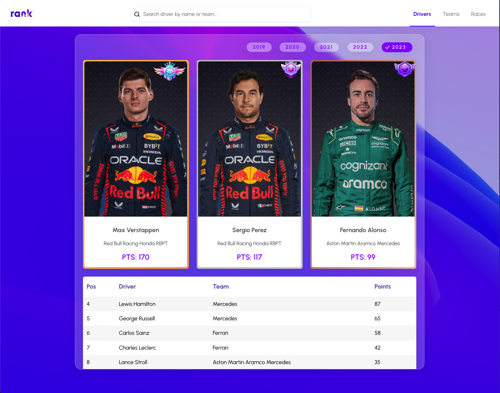

<h1 align="center"></h1>

Races Result <small>[Web]</small> Hiển thị bảng xếp hạng tay đua, đội đua và thông tin các chặng đua F1 từ trang [https://www.formula1.com/](https://www.formula1.com/) từ năm 2019 đến 2023. Ngoài ra, trang web cho phép tìm kiếm thông tin của các tay đua dựa vào tên hoặc đội đua mà họ tham gia. Hiển thị biểu đồ thống kê số điểm & thứ hạng của các tay đua theo từng mùa giải mà họ tham gia.

## Tính năng
1. Xem xếp hạng của các tay đua theo từng năm. (Chọn `Drivers` trên thanh menu). Chọn năm cần xem (Mặc định là 2023).
2. Xem xếp hạng của các đội đua theo từng năm. (Chọn `Teams` trên thanh menu). Chọn năm cần xem (Mặc định là 2023).
3. Xem thông tin của các chặng đua theo từng năm. (Chọn `Races` trên thanh Header). Chọn năm cần xem (Mặc định là 2023).
4. Tìm kiếm thông tin của tay đua ở ô tìm kiếm trên thanh Header.
5. Đổi màu nền bằng cách thay đổi giá trị trong thanh `Toolbox` nằm trên màn hình.
## Thực thi dự án
1. Server:

Thư mục chứa mã nguồn viết bằng NodeJS dùng để crawl dữ liệu từ trang [https://www.formula1.com/](https://www.formula1.com/). Để cung cấp dữ liệu cho website hiển thị. 
Để cài đặt thư viện cần thiết, hãy mở terminal trong thư mục chứa dự án và dùng dòng lệnh bên dưới:
```bash
cd ./server && npm install
```
Để lấy dữ liệu mới, dùng dòng lệnh sau:
```bash
npm start
```
Chi tiết quá trình crawl dữ liệu sẽ hiển thị dưới dạng log của terminal. Dữ liệu sau khi lấy xong sẽ được ghi vào thư mục `server/data` dưới dạng file `.json`.

2. Client:

Thư mục chứa mã nguồn website được viết bằng ReactJS. Sử dụng Vite để build & dev. Dữ liệu trong trang web được chứa trong thư mục `client/src/data`. Dữ liệu này được lấy từ thư mục `server/data`.
Để cài đặt thư viện cần thiết, hãy mở terminal trong thư mục chứa dự án và dùng dòng lệnh bên dưới:
```bash
cd ./client && npm install
```
Để chạy dự án ở chế độ development (DEV). Hãy dùng dòng lệnh sau:
```bash
npm run dev
```
Truy cập đường dẫn: http://localhost:5173/ để xem kết quả.

Để chạy dự án ở chế độ production (PROD). Hãy dùng:
```bash
npm run build && npm run preview
```
Truy cập đường dẫn: http://localhost:4173/ để xem kết quả.

## Framework & Library
1. Front-end
- [Vite](https://vitejs.dev/)
- [React](https://react.dev/)
- [Three.js](https://threejs.org/)
- [React Icons](https://react-icons.github.io/react-icons/)
- [Redux-toolkit](https://redux-toolkit.js.org/)
- [TypeScript](https://www.typescriptlang.org/)
- [Sass](https://sass-lang.com/)
- [ApexCharts](https://apexcharts.com/)
- [@react-three/fiber](https://docs.pmnd.rs/react-three-fiber/getting-started/introduction)
- [lamina](https://www.npmjs.com/package/lamina), [leva](https://github.com/pmndrs/leva)
- [Debounce](https://www.npmjs.com/package/use-debounce), [Delay](https://www.npmjs.com/package/delay), [Clsx](https://www.npmjs.com/package/clsx)

2. Back-end
- [Node.js](https://nodejs.org/en)
- [Cheerio](https://cheerio.js.org/)
- [Axios](https://axios-http.com/docs/intro)
- [Uuid](https://www.npmjs.com/package/uuid)


## Tham khảo
- https://codesandbox.io/s/layer-materials-forked-fm366c?file=/src/App.js:0-1990
- https://www.pinterest.com/